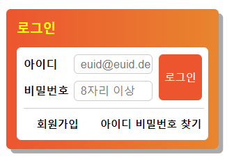

## Mission-01

- [General info](#general-info)
- [Results](#results)

## General info

피그마로 주어진 Web Cafe 시안의 일부를 구현한 결과물입니다.

## Results

1. login



## Description

- login:
  form 태그 내에 아이디와 비밀번호 각각의 div영역을 설정하고 내부에 label과 input요소로 화면을 구성하였습니다.\
  button 태그에 position: absolute; 속성을 주어 위치를 지정하였습니다.\
  회원가입 / 아이디 비밀번호 찾기 영역은 float: left;를 사용하여 정렬하였습니다.

```
form.loginForm
│
├── div.id-box
│    └── <label for="username">아이디</label>
│    └── <input id="username" type="text" name="username" placeholder="euid@euid.de">
│
└── div.pw-box
│    └── <label for="password">비밀번호</label>
│    └── <input id="password" type="password" name="password" placeholder="8자리 이상">
│
└── <button type="submit">로그인</button>
│
└── ul
│    └── <li><a href="/">회원가입</a></li>
│    └── <li><a href="/">아이디 비밀번호 찾기</a></li>
```
