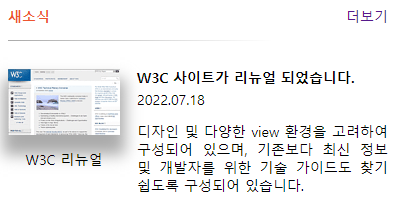

## Mission-04

- [General info](#general-info)
- [Results](#results)

## General info

피그마로 주어진 Web Cafe 시안의 일부를 구현한 결과물입니다.

## Results

1.news



## Description

- news:
  전체 영역을 section 태그로 감싸고 h2 로 타이틀을, a태그에 더보기란을 명시하였으며 section 태그에 가상 요소를 추가하여 구분선을 표현하였습니다.
  이미지와 텍스트를 각각 div 태그로 묶어주고 gird 속성을 이용하여 전체 콘텐츠의 구역을 나누었습니다.

```
├── section.news
│   ├── h2.title
│   ├── a.more
│   ├── div.img_con
│   │   ├── img
│   │   └── span
│   └── div.txt_con
│       ├── h3
│       ├── span
│       └── p

```
