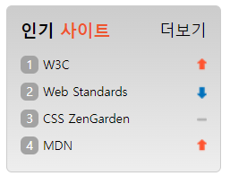

## Mission-05

- [General info](#general-info)
- [Results](#results)

## General info

피그마로 주어진 Web Cafe 시안의 일부를 구현한 결과물입니다.

## Results

1.Favorite Site



## Description

- Favorite Site:
  전체 영역을 section 태그로 감싸고 h2 로 타이틀을, a태그에 더보기란을 명시하였으며 flex를 사용하여 타이틀을 정렬하였습니다.\
  사이트 리스트는 ol 태그를 사용하였으며 각 순위의 번호는 ::befor 가상 요소를 사용하여 표현하였습니다.\
  각 순위별 오른쪽에 위치한 상승/하강 아이콘은 a태그에 스프라이트 기법을 적용하여 표현하였습니다.

```
├── section.favorite_site
│   ├── div.tit_box
│   │   ├── h2
│   │   └── a.more
│   └── ol
│       ├── li
│       │   └── a
│       ├── li
│       │   └── a
│       ├── li
│       │   └── a
│       └── li
│           └── a
```
